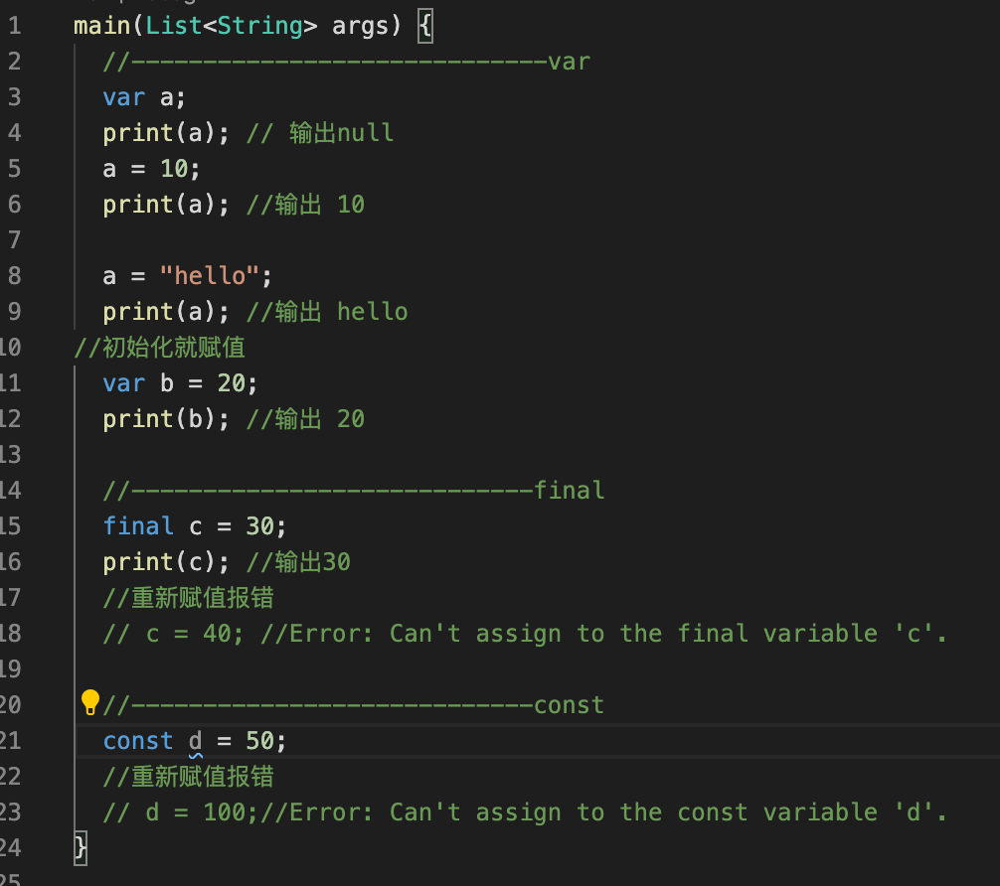
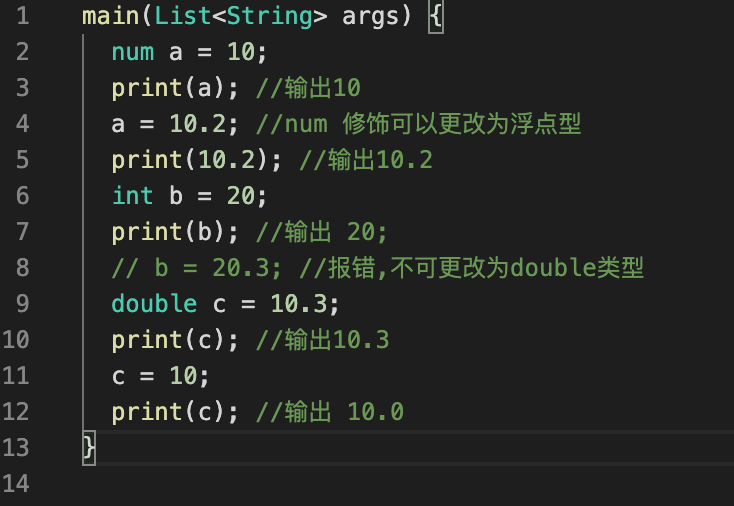
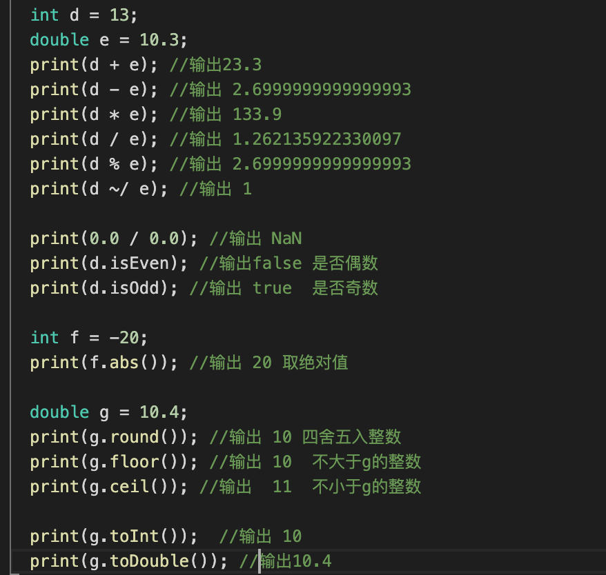

> 今天主题是Dart编程语言的数据类型,Dart语言是Google公司出的一种面向对象开源的编程语言.在上一篇中我们已经安装好了flutter 环境,**flutter sdk**中自带`dart` sdk,我们都已经配置好了

### Hello Dart
1. Hello World  
学习编程语言，从祖传的Hello World开始,在VSCode中创建一个helloworld.dart文件.输入一下内容
```
main(List<String> args) {
  print('hello world');
}
```
### `变量和常量`
**变量**
* 使用`var`声明变量可赋予不同类型的值
* 未初始化时,默认值是`null`

---
**常量**
* 使用 `final`声明一个只能赋值一次的常量
* 使用`const`声明常量
* 使用声明的必须是编译期常量 (运行时)

#### final和const有什么区别呢?

* const在赋值时, 赋值的内容必须是在编译期间就确定下来的(编译期常量)
* final在赋值时, 可以动态获取, 比如赋值一个函数 (运行时常量)  
区别可以看下
[Flutter 知识梳理（Dart）-Dart中static final const 区别](https://juejin.im/post/5d396a03f265da1b68370110#heading-5)
### `数值型`
>对于数值来说，我们也不用关心它是否有符号，以及数据的宽度和精度等问题。只要记着整数用`int`，浮点数用`double`就行了。


#### 数值型操作
* 运算符: `+` , `-` , `*` , `/` , `%` , `~/`(取整) ,
*  常用属性: `isNaN` , `isEven` , `isOdd`
* 常用方法: `abs()` , `round()` , `floor()` , `ceil()` , `toInt()` , `toDouble()`  

### `字符串`
* 使用引号,或者双引号创建字符串
* 使用三个引号或双引号创建多行字符串
* 使用r创建原始raw字符串
```
  String str1 = "Hello"; //''
  String str2 = """Hello
  Dart""";
  //输出:
  //Hello
  //  Dart
  print(str2);
  String str3 = "Hello \nDart";
  //输出
  //Hello
  //Dart
  print(str3);
  String str4 = r"Hello \nDart";
  print(str4);
  //输出Hello \nDart
```
#### 字符串操作
* 运算符: `+` , `*` , `==` , `[]` ,
```
  String str5 = "My name is lilei";
  print(str5 + " haha");
  //My name is lilei haha
  print(str5 * 2);
  //My name is lileiMy name is lilei
  print(str5 == str4);
  //false
  print(str5[1]);//取下标字符
  //y
```
* 插值表达式: `$(expression)`
```
  int a = 1;
  int b = 2;
  print("a + b = ${a + b}");
  //a + b = 3
  print("a = $a");
  //a = 1
```
* 常用属性: `length` , `isEmpty` , `isNotEmpty` 
```
  print(str5.length);
  //16
  print(str5.isEmpty);
  //false
```
#### 常用方法
* `contains()` , `subString()`
* `startsWith()` , `endsWith()`
* `indexOf()` , `lastIndexOf()`
* `toLowerCase()` , `toUpperCase()`
* `trim()` , `trimLeft()` , `trimRight()`
* `split()` , `replaceXXX()`

```
print(str5.contains('My'));
  //true
  print(str5.substring(0, 2));
  //My
  print(str5.startsWith('a'));
  //false
  print(str5.endsWith('lei'));
  //true
  print(str5.indexOf('l'));
  //11
  print(str5.lastIndexOf('l'));
  //13
  print(str5.toLowerCase());
  //my name is lilei
  print(str5.toUpperCase());
  //MY NAME IS LILEI
  print(str5.trim()); //删除前后空格
  //My name is lilei
  print(str5.trimLeft()); //删除左空格
  print(str5.trimRight()); //删除右空格
  var list = str5.split(' ');
  print(list);
  //[My, name, is, lilei]
```
### `布尔型`

* 使用 `bool` 表示布尔类型
* 布尔值只有`true` 和 `false`

```
// 布尔类型
var isFlag = true;
print('$isFlag ${isFlag.runtimeType}');
```
> **`注意`**: Dart中不能判断非0即真, 或者非空即真
```
var message = 'Hello Dart';
  // 错误的写法
  if (message) {
    print(message);
  }
```

### `列表List`
#### List(数组)创建
* 创建List: `var list = [1, 2, 3];`
* 创建不可变的List: `var list = const [1, 2, 3];`
* 构造创建: `var list = new List();`
#### 常用操作
* `[]` , `length`
* `add()` , `insert()`
* `remove()` , `clear()`
* `indexOf()` , `lastIndexOf()`
* `sort()` , `sublist()`
* `shuffle()` , `asMap()` , `forEach()`
```
var list = ["Hello", "Dart"];
  print(list.length);
  //2
  list.add('New');
  print(list);
  //[Hello, Dart, New]
  list.insert(1, "My");
  print(list);
  //[Hello, My, Dart, New]
  list.remove("My");
  print(list);
  //[Hello, Dart, New]
  // list.clear();
  // print(list);
  //[]
  print(list.indexOf("Dart"));
  //1
  print(list.indexOf("Dart1"));
  //-1
  print(list.lastIndexOf("New"));
  //2
  list.sort();
  print(list);
  //[Dart, Hello, New]
  list.sublist(0, 1);
  print(list.sublist(0, 1));
  //[Dart]
  list.shuffle(); //打乱顺序
  print(list);
  //[Hello, Dart, New]
  list.forEach((element) {
    print(element);
  });
  //Hello
  // Dart
  // New
```
### `集合Set`

* 其实，也就是把[]换成{}就好了。
* Set和List最大的两个不同就是：Set是无序的，并且元素是不重复的。
```
var a = {'a','b','c','d'};
```

### `Map`
#### Map创建
* 创建Map: `var language = {'first':'Dart','second':'OC'};`
* 创建不可变Map: `var language = const {'first':'Dart','second':'OC'};`
* 构造创建: `var language = new Map();`
```
  var map1 = {'first': 'Dart', 1: true};
  print(map1);
  //{first: Dart, 1: true}
  print(map1['first']);
  //Dart
  map1[1] = false;
  print(map1);
  //{first: Dart, 1: false}

  //不可变
  var map2 = {'dart': 'good', 'swift': 'good too'};
  // map2[1] = "python";不可更改
```
#### 常用操作
* `[]` , `length`
* `isEmpty()` , `isNotEmpty()`
* `Keys` , `values`
* `containsKey()` , `containsValue()`
* `remove()`
* `forEach()`

```
var map = {'first': 'Dart', 'second': 'Python', 'third': 'Java'};
  print(map.length);
  //3
  print(map.isEmpty);
  //false
  print(map.keys);
  //(first, second, third)
  print(map.values);
  //(Dart, Python, Java)
  print(map.containsKey('forth'));
  //false
  print(map.containsValue('Java'));
  //true
  map.remove('second');
  print(map);
  //{first: Dart, third: Java}
  map.forEach((key, value) {
    print("${key + value}");
  });
  //firstDart
  //thirdJava
  var list = ['a', 'b', 'c'];
  print(list.asMap());
  //{0: a, 1: b, 2: c}
```
### `dynamic`

```
  var a;
  a = 10;
  a = 'b';
  //a 此时是一个动态类型 dynamic
  dynamic b = 20;
  b = 'Java';
  var list = List<dynamic>();
  list.add(1);
  list.add('Hello');
  list.add(true);
  print(list);
  //[1, Hello, true]
```