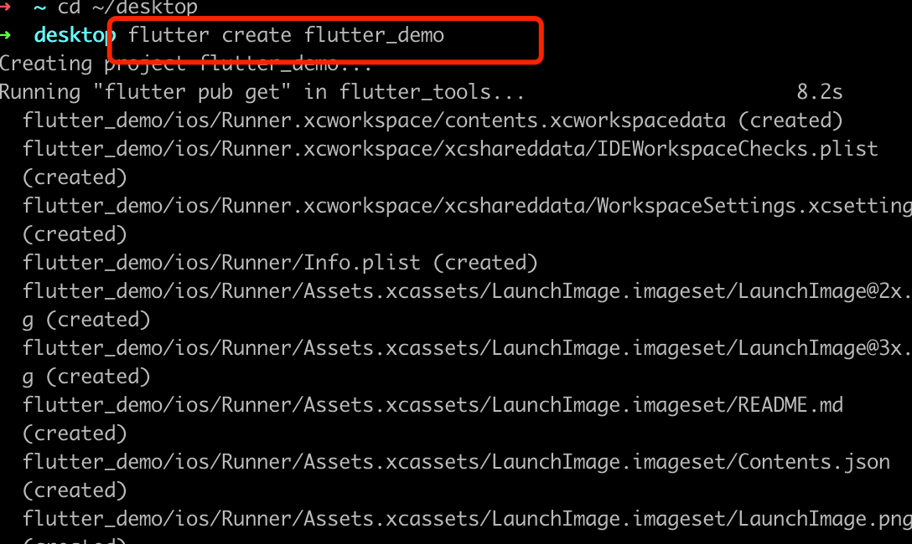
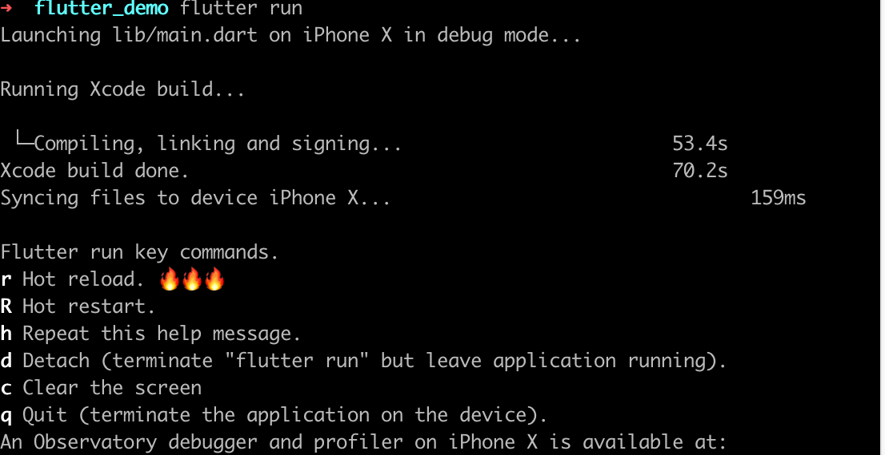
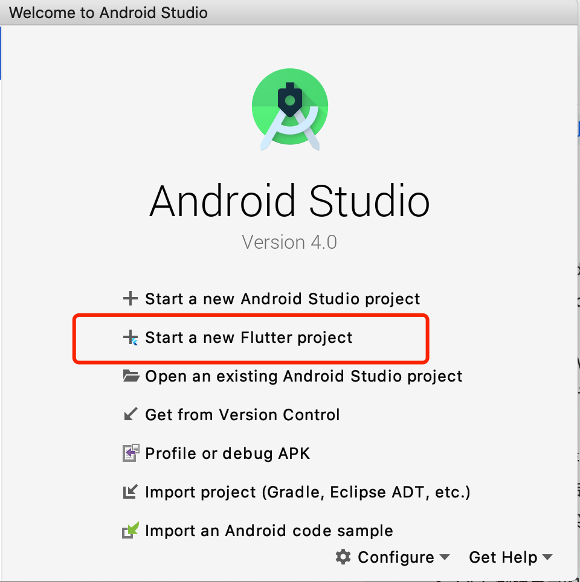
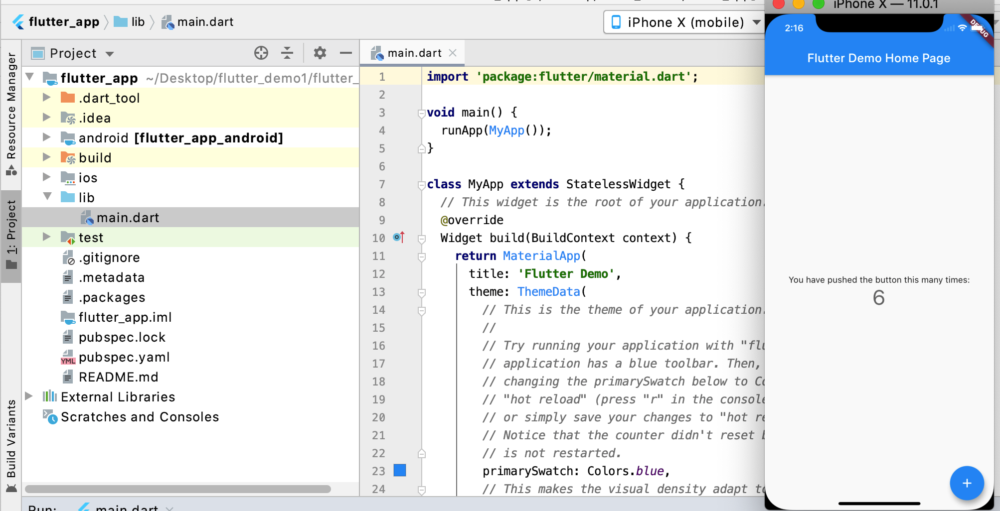
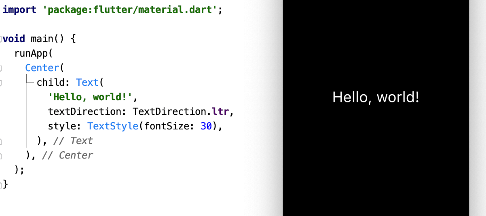
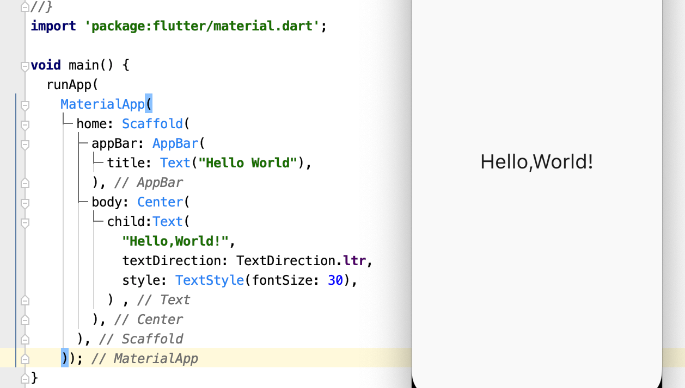

> 学习完Dart语言基础,我们来学习Flutter框架中的一些知识,控件使用,网络请求,手势操作等.

## 创建Flutter项目
> 创建Flutter项目有两种方式：`通过命令行创建` 和 `通过开发工具创建`

### 通过命令行创建
通过命令行创建很简单,类似于React-Native,使用命令创建项目
```
flutter create flutter_demo
```


再打开模拟器,创建项目的路径下运行命令
```
flutter run
```


### 通过开发工具创建
这里我们使用 `Android Studio`创建一个Flutter项目

选择application下一步,创建完成.
运行

* 在目录下有一个lib文件夹，里面会存放我们编写的Flutter代码；

* 打开发现里面有一个main.dart，它是我们Flutter启动的入口文件，里面有main函数

## 开始Flutter 代码
我们把`main.dart`中的代码删除,增加以下代码
```
import 'package:flutter/material.dart';

void main() {
  runApp(
    Center(
      child: Text(
        'Hello, world!',
        textDirection: TextDirection.ltr,
      ),
    ),
  );
}

```
下面我们分析以下上面的代码
runApp() 函数会持有传入的 Widget，并且使它成为 widget 树中的根节点。在这个例子中，Widget 树有两个 widgets， Center widget 及其子 widget ——Text 。框架会强制让根 widget 铺满整个屏幕，也就是说“Hello World”会在屏幕上居中显示。在这个例子我们需要指定文字的方向
### **runApp()**
`runApp`是Flutter内部提供的一个函数，当我们启动一个Flutter应用程序时就是从调用这个函数开始的
```
void runApp(Widget app) {
  ...省略代码
}
```
该函数让我们传入一个`widget`        
`widget`到底是啥?   
安卓和iOS开发的人一般喜欢称为**控件**,
前端开发人员一般喜欢称为**组件**
### **基础 widgets**
* **Text**  
`Text` widget 可以用来在应用内创建带样式的文本。

* **Row, Column**   
这两个 flex widgets 可以让你在水平 (`Row`) 和垂直(`Column`) 方向创建灵活的布局。它是基于 web 的 flexbox 布局模型设计的。

* **Stack**     
`Stack` widget 不是线性（水平或垂直）定位的，而是按照绘制顺序将 widget 堆叠在一起。你可以用 [Positioned](https://api.flutter-io.cn/flutter/widgets/Positioned-class.html) widget 作为`Stack` 的子 widget，以相对于 `Stack` 的上，右，下，左来定位它们。 `Stack` 是基于 Web 中的绝对位置布局模型设计的。

* **Container**     
`Container` widget 可以用来创建一个可见的矩形元素。 `Container` 可以使用 [BoxDecoration](https://api.flutter-io.cn/flutter/painting/BoxDecoration-class.html) 来进行装饰，如背景，边框，或阴影等。 `Container` 还可以设置外边距、内边距和尺寸的约束条件等。另外，`Container`可以使用矩阵在三维空间进行转换。

### 代码改进
我们可能希望文字大一些,
  * **文字大一些:** 需要给Text文本设置一些样式；
  ```
  import 'package:flutter/material.dart';

main(List<String> args) {
  runApp(
    Center(
      child: Text(
        "Hello World",
        textDirection: TextDirection.ltr,
        style: TextStyle(fontSize: 36),
      ),
    )
  );
}

  ```
  

目前我们虽然可以显示HelloWorld，但是我们发现最底部的背景是黑色，并且我们的页面并不够结构化。

正常的App页面应该有一定的结构，比如通常都会有`导航栏`，会有一些`背景颜色`等

在开发当中，我们并不需要从零去搭建这种结构化的界面，我们可以使用`Material库`，直接使用其中的一些封装好的组件来完成一些结构的搭建。
```
import 'package:flutter/material.dart';

void main() {
  runApp(
    MaterialApp(
      home: Scaffold(
        appBar: AppBar(
          title: Text("Hello World"),
        ),
        body: Center(
          child:Text(
            "Hello,World!",
            textDirection: TextDirection.ltr,
            style: TextStyle(fontSize: 30),
          ) ,
        ),
      ),
    ));
}
```


Scaffold是什么呢？

* 翻译过来是`脚手架`，脚手架的作用就是搭建页面的基本结构；
* 所以我们给MaterialApp的home属性传入了一个Scaffold对象，作为启动显示的Widget；
* Scaffold也有一些属性，比如`appBar`和`body`；
* appBar是用于设计导航栏的，我们传入了一个`title属性`；
* body是页面的内容部分，我们传入了之前已经创建好的Center中包裹的一个Text的Widget；
