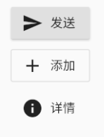

> 本文学习Flutter 的基础组件
## Widget简介
> 与原生开发中“控件”不同的是，Flutter中的Widget的概念更广泛，它不仅可以表示UI元素，也可以表示一些功能性的组件如：用于手势检测的 GestureDetector widget、用于APP主题数据传递的Theme等等
### StatelessWidget
StatelessWidget用于不需要维护状态的场景，它通常在build方法中通过嵌套其它Widget来构建UI
```
class Echo extends StatelessWidget {
  const Echo({
    Key key,  
    @required this.text,
    this.backgroundColor:Colors.grey,
  }):super(key:key);

  final String text;
  final Color backgroundColor;

  @override
  Widget build(BuildContext context) {
    return Center(
      child: Container(
        color: backgroundColor,
        child: Text(text),
      ),
    );
  }
}
```
上面的代码，实现了一个回显字符串的Echo widget。
```
Widget build(BuildContext context) {
  return Echo(text: "hello world");
}
```
### StatefulWidget
StatefulWidget 是有状态控件，这样的控件拥有自己的私有数据和业务逻辑
```
// 定义一个 电影详情 控件，继承自 StatefulWidget
class MovieDetail extends StatefulWidget {
  // 构造函数，初始化当前组件必须的 id 属性
  MovieDetail({Key key, @required this.id}) : super(key: key);
 
  // 电影的Id值
  final String id;
 
  // StatefulWidget 控件必须实现 createState 函数
  // 在 createState 函数中，必须返回一个继承自 State<T> 状态类的对象
  // 这里的 _MovieDetailState 就继承自 State<T>
  _MovieDetailState createState() => new _MovieDetailState();
}
// 这个继承自 State<T> 的类，专门用来定义有状态控件的 业务逻辑 和 私有数据
class _MovieDetailState extends State<MovieDetail> {
  // 1. 定义私有状态数据【以 _ 开头的数据，是当前类的私有数据】
  int _count;
 
  // 2. 通过 initState 生命周期函数，来初始化私有数据
  @override
  void initState() {
    super.initState();
    // 2.1 把 _count 的值初始化为 0
    _count = 0;
  }
 
  // build 函数是必须的，用来渲染当前有状态控件对应的 UI 结构
  @override
  Widget build(BuildContext context) {
    // 注意：在这个 _MovieDetailState 状态类中，可以使用 widget 对象访问到 StatefulWidget 控件中的数据并直接使用
    // 例如：widget.id
    return Column(
      children: <Widget>[
        Text('MovieDetail --' + widget.id + ' --- ' + _count.toString()),
        RaisedButton(
          child: Icon(Icons.add),
          // 3. 指定点击事件的处理函数为 _add
          onPressed: _add,
        )
      ],
    );
  }
 
  // 4. 定义 _count 自增的函数【以 _ 开头的函数，是私有函数】
  void _add() {
    // 如果要为私有数据重新赋值，必须调用 setState() 函数
    setState(() {
      // 让私有数据 _count 自增 +1
      _count++;
    });
  }
}
```
#### State
一个`StatefulWidget`类会对应一个`State`类，`State`表示与其对应的`StatefulWidget`要维护的状态，`State`中的保存的状态信息可以：

* 在`widget` 构建时可以被同步读取。
* 在`widget`生命周期中可以被改变，当`State`被改变时，可以手动调用其`setState()`方法通知Flutter framework状态发生改变，Flutter framework在收到消息后，会重新调用其`build方法`重新构建widget树，从而达到更新UI的目的。

State中有两个常用属性：

* `widget`，它表示与该State实例关联的widget实例，由Flutter framework动态设置。注意，这种关联并非永久的，因为在应用生命周期中，UI树上的某一个节点的widget实例在重新构建时可能会变化，但State实例只会在第一次插入到树中时被创建，当在重新构建时，如果widget被修改了，Flutter framework会动态设置State.widget为新的widget实例。

* `context`。`StatefulWidget`对应的`BuildContext`，作用同`StatelessWidget`的`BuildContext`。

##### State生命周期
```
class _CounterWidgetState extends State<CounterWidget> {  
  int _counter;

  @override
  void initState() {
    super.initState();
    //初始化状态  
    _counter=widget.initValue;
    print("initState");
  }

  @override
  Widget build(BuildContext context) {
    print("build");
    return Scaffold(
      body: Center(
        child: FlatButton(
          child: Text('$_counter'),
          //点击后计数器自增
          onPressed:()=>setState(()=> ++_counter,
          ),
        ),
      ),
    );
  }

  @override
  void didUpdateWidget(CounterWidget oldWidget) {
    super.didUpdateWidget(oldWidget);
    print("didUpdateWidget");
  }

  @override
  void deactivate() {
    super.deactivate();
    print("deactive");
  }

  @override
  void dispose() {
    super.dispose();
    print("dispose");
  }

  @override
  void reassemble() {
    super.reassemble();
    print("reassemble");
  }

  @override
  void didChangeDependencies() {
    super.didChangeDependencies();
    print("didChangeDependencies");
  }

}
```
* `initState`：当Widget第一次插入到Widget树时会被调用，对于每一个State对象，Flutter framework只会调用一次该回调，所以，通常在该回调中做一些一次性的操作，如状态初始化、订阅子树的事件通知等。不能在该回调中调用`BuildContext.dependOnInheritedWidgetOfExactType`（该方法用于在Widget树上获取离当前widget最近的一个父级`InheritFromWidget`），原因是在初始化完成后，Widget树中的`InheritFromWidget`也可能会发生变化，所以正确的做法应该在在`build（）`方法或`didChangeDependencies()`中调用它。
* `didChangeDependencies()`：当State对象的依赖发生变化时会被调用；例如：在之前`build()` 中包含了一个`InheritedWidget`，然后在之后的`build()` 中`InheritedWidget`发生了变化，那么此时`InheritedWidget`的子widget的`didChangeDependencies()`回调都会被调用。典型的场景是当系统语言Locale或应用主题改变时，Flutter framework会通知widget调用此回调。
* `build()`：此回调读者现在应该已经相当熟悉了，它主要是用于构建Widget子树的，会在如下场景被调用：

在调用`initState()`之后。
在调用`didUpdateWidget()`之后。
在调用`setState()`之后。
在调用`didChangeDependencies()`之后。
在State对象从树中一个位置移除后（会调用deactivate）又重新插入到树的其它位置之后。
* `reassemble()`：此回调是专门为了开发调试而提供的，在热重载(hot reload)时会被调用，此回调在Release模式下永远不会被调用。
* `didUpdateWidget()`：在widget重新构建时，Flutter framework会调用`Widget.canUpdate`来检测Widget树中同一位置的新旧节点，然后决定是否需要更新，如果`Widget.canUpdate`返回`true`则会调用此回调。正如之前所述，`Widget.canUpdate`会在新旧widget的key和runtimeType同时相等时会返回true，也就是说在在新旧widget的key和runtimeType同时相等时`didUpdateWidget()`就会被调用。
* `deactivate()`：当State对象从树中被移除时，会调用此回调。在一些场景下，Flutter framework会将State对象重新插到树中，如包含此State对象的子树在树的一个位置移动到另一个位置时（可以通过GlobalKey来实现）。如果移除后没有重新插入到树中则紧接着会调用`dispose()`方法。
* `dispose()`：当State对象从树中被永久移除时调用；通常在此回调中释放资源。

## 状态管理
>Widget管理自己的状态。

>Widget管理子Widget状态。

>混合管理（父Widget和子Widget都管理状态）。

如何决定使用哪种管理方法？下面是官方给出的一些原则可以帮助你做决定：

* 如果状态是用户数据，如复选框的选中状态、滑块的位置，则该状态最好由父Widget管理。
* 如果状态是有关界面外观效果的，例如颜色、动画，那么状态最好由Widget本身来管理。
* 如果某一个状态是不同Widget共享的则最好由它们共同的父Widget管理。

接下来，我们将通过创建三个简单示例TapboxA、TapboxB和TapboxC来说明管理状态的不同方式。 这些例子功能是相似的 ——创建一个盒子，当点击它时，盒子背景会在绿色与灰色之间切换。状态 _active确定颜色：绿色为true ，灰色为false
### Widget管理自身状态
**`_TapboxAState`** 类:

* 管理`TapboxA`的状态。
* 定义`_active`：确定盒子的当前颜色的布尔值。
* 定义`_handleTap()`函数，该函数在点击该盒子时更新`_active`，并调用`setState()`更新UI。
* 实现widget的所有交互式行为。
```
// TapboxA 管理自身状态.

//------------------------- TapboxA ----------------------------------

class TapboxA extends StatefulWidget {
  TapboxA({Key key}) : super(key: key);

  @override
  _TapboxAState createState() => new _TapboxAState();
}

class _TapboxAState extends State<TapboxA> {
  bool _active = false;

  void _handleTap() {
    setState(() {
      _active = !_active;
    });
  }

  Widget build(BuildContext context) {
    return new GestureDetector(
      onTap: _handleTap,
      child: new Container(
        child: new Center(
          child: new Text(
            _active ? 'Active' : 'Inactive',
            style: new TextStyle(fontSize: 32.0, color: Colors.white),
          ),
        ),
        width: 200.0,
        height: 200.0,
        decoration: new BoxDecoration(
          color: _active ? Colors.lightGreen[700] : Colors.grey[600],
        ),
      ),
    );
  }
}
```
### 父Widget管理子Widget的状态
**`ParentWidgetState`** 类:

* 为TapboxB 管理`_active`状态。
* 实现`_handleTapboxChanged()`，当盒子被点击时调用的方法。
* 当状态改变时，调用`setState()`更新UI。

**TapboxB** 类:

* 继承`StatelessWidget`类，因为所有状态都由其父组件处理。
* 当检测到点击时，它会通知父组件。
```
// ParentWidget 为 TapboxB 管理状态.

//------------------------ ParentWidget --------------------------------

class ParentWidget extends StatefulWidget {
  @override
  _ParentWidgetState createState() => new _ParentWidgetState();
}

class _ParentWidgetState extends State<ParentWidget> {
  bool _active = false;

  void _handleTapboxChanged(bool newValue) {
    setState(() {
      _active = newValue;
    });
  }

  @override
  Widget build(BuildContext context) {
    return new Container(
      child: new TapboxB(
        active: _active,
        onChanged: _handleTapboxChanged,
      ),
    );
  }
}

//------------------------- TapboxB ----------------------------------

class TapboxB extends StatelessWidget {
  TapboxB({Key key, this.active: false, @required this.onChanged})
      : super(key: key);

  final bool active;
  final ValueChanged<bool> onChanged;

  void _handleTap() {
    onChanged(!active);
  }

  Widget build(BuildContext context) {
    return new GestureDetector(
      onTap: _handleTap,
      child: new Container(
        child: new Center(
          child: new Text(
            active ? 'Active' : 'Inactive',
            style: new TextStyle(fontSize: 32.0, color: Colors.white),
          ),
        ),
        width: 200.0,
        height: 200.0,
        decoration: new BoxDecoration(
          color: active ? Colors.lightGreen[700] : Colors.grey[600],
        ),
      ),
    );
  }
}
```
### 混合状态管理

**`_ParentWidgetStateC`** 类:

* 管理`_active` 状态。
* 实现 `_handleTapboxChanged()` ，当盒子被点击时调用。
* 当点击盒子并且`_active`状态改变时调用`setState()`更新UI。

**`_TapboxCState`** 对象:

* 管理`_highlight` 状态。
* `GestureDetector`监听所有tap事件。当用户点下时，它添加高亮（深绿色边框）；当用户释放时，会移除高亮。
* 当按下、抬起、或者取消点击时更新`_highlight`状态，调用`setState()`更新UI。
* 当点击时，将状态的改变传递给父组件。
```
//---------------------------- ParentWidget ----------------------------

class ParentWidgetC extends StatefulWidget {
  @override
  _ParentWidgetCState createState() => new _ParentWidgetCState();
}

class _ParentWidgetCState extends State<ParentWidgetC> {
  bool _active = false;

  void _handleTapboxChanged(bool newValue) {
    setState(() {
      _active = newValue;
    });
  }

  @override
  Widget build(BuildContext context) {
    return new Container(
      child: new TapboxC(
        active: _active,
        onChanged: _handleTapboxChanged,
      ),
    );
  }
}

//----------------------------- TapboxC ------------------------------

class TapboxC extends StatefulWidget {
  TapboxC({Key key, this.active: false, @required this.onChanged})
      : super(key: key);

  final bool active;
  final ValueChanged<bool> onChanged;

  @override
  _TapboxCState createState() => new _TapboxCState();
}

class _TapboxCState extends State<TapboxC> {
  bool _highlight = false;

  void _handleTapDown(TapDownDetails details) {
    setState(() {
      _highlight = true;
    });
  }

  void _handleTapUp(TapUpDetails details) {
    setState(() {
      _highlight = false;
    });
  }

  void _handleTapCancel() {
    setState(() {
      _highlight = false;
    });
  }

  void _handleTap() {
    widget.onChanged(!widget.active);
  }

  @override
  Widget build(BuildContext context) {
    // 在按下时添加绿色边框，当抬起时，取消高亮  
    return new GestureDetector(
      onTapDown: _handleTapDown, // 处理按下事件
      onTapUp: _handleTapUp, // 处理抬起事件
      onTap: _handleTap,
      onTapCancel: _handleTapCancel,
      child: new Container(
        child: new Center(
          child: new Text(widget.active ? 'Active' : 'Inactive',
              style: new TextStyle(fontSize: 32.0, color: Colors.white)),
        ),
        width: 200.0,
        height: 200.0,
        decoration: new BoxDecoration(
          color: widget.active ? Colors.lightGreen[700] : Colors.grey[600],
          border: _highlight
              ? new Border.all(
                  color: Colors.teal[700],
                  width: 10.0,
                )
              : null,
        ),
      ),
    );
  }
}
```
## 文本及字体样式
### `Text`
```
Text("Hello world",
  textAlign: TextAlign.left,
  maxLines: 1,
  overflow: TextOverflow.ellipsis,
  textScaleFactor: 1.5,
  style: TextStyle(
    color: Colors.blue,
    fontSize: 18.0,
    height: 1.2,  
    fontFamily: "Courier",
    background: new Paint()..color=Colors.yellow,
    decoration:TextDecoration.underline,
    decorationStyle: TextDecorationStyle.dashed
  ),
);
```
* `textAlign`：文本的对齐方式；可以选择左对齐、右对齐还是居中
* `maxLines`、`overflow`：指定文本显示的最大行数，默认情况下，文本是自动折行的，如果指定此参数，则文本最多不会超过指定的行。如果有多余的文本，可以通过overflow来指定截断方式，默认是直接截断
* `textScaleFactor`：代表文本相对于当前字体大小的缩放因子，相对于去设置文本的样式style属性的fontSize，它是调整字体大小的一个快捷方式
* `TextStyle`用于指定文本显示的样式如颜色、字体、粗细、背景等

#### TextSpan
如果我们需要对一个Text内容的不同部分按照不同的样式显示，这时就可以使用`TextSpan`
```
const TextSpan({
  TextStyle style, 
  Sting text,
  List<TextSpan> children,
  GestureRecognizer recognizer,
});
```

```
Text.rich(TextSpan(
    children: [
     TextSpan(
       text: "Home: "
     ),
     TextSpan(
       text: "https://flutterchina.club",
       style: TextStyle(
         color: Colors.blue
       ),  
       recognizer: _tapRecognizer
     ),
    ]
))
```
#### DefaultTextStyle
在Widget树中，文本的样式默认是可以被继承的（子类文本类组件未指定具体样式时可以使用Widget树中父级设置的默认样式），因此，如果在Widget树的某一个节点处设置一个默认的文本样式，那么该节点的子树中所有文本都会默认使用这个样式，而DefaultTextStyle正是用于设置默认文本样式的
```
DefaultTextStyle(
  //1.设置文本默认样式  
  style: TextStyle(
    color:Colors.red,
    fontSize: 20.0,
  ),
  textAlign: TextAlign.start,
  child: Column(
    crossAxisAlignment: CrossAxisAlignment.start,
    children: <Widget>[
      Text("hello world"),
      Text("I am Jack"),
      Text("I am Jack",
        style: TextStyle(
          inherit: false, //2.不继承默认样式
          color: Colors.grey
        ),
      ),
    ],
  ),
);
```

#### 字体
在Flutter中使用字体分两步完成。首先在`pubspec.yaml`中声明它们，以确保它们会打包到应用程序中。然后通过`TextStyle`属性使用字体。
* **在asset中声明**
要将字体文件打包到应用中，和使用其它资源一样，要先在pubspec.yaml中声明它。然后将字体文件复制到在pubspec.yaml中指定的位置。
```
flutter:
  fonts:
    - family: Raleway
      fonts:
        - asset: assets/fonts/Raleway-Regular.ttf
        - asset: assets/fonts/Raleway-Medium.ttf
          weight: 500
        - asset: assets/fonts/Raleway-SemiBold.ttf
          weight: 600
    - family: AbrilFatface
      fonts:
        - asset: assets/fonts/abrilfatface/AbrilFatface-Regular.ttf
```
* **使用字体**
```
// 声明文本样式
const textStyle = const TextStyle(
  fontFamily: 'Raleway',
);

// 使用文本样式
var buttonText = const Text(
  "Use the font for this text",
  style: textStyle,
);
```
## 按钮
###  Material组件库中的按钮
* **RaisedButton**
>`RaisedButton` 即"漂浮"按钮，它默认带有阴影和灰色背景。按下后，阴影会变大


```
RaisedButton(
  child: Text("normal"),
  onPressed: () {},
);
```
* **FlatButton**
>`FlatButton`即扁平按钮，默认背景透明并不带阴影。按下后，会有背景色


```
FlatButton(
  child: Text("normal"),
  onPressed: () {},
)
```
* **OutlineButton**
>`OutlineButton`默认有一个边框，不带阴影且背景透明。按下后，边框颜色会变亮、同时出现背景和阴影(较弱)


```
OutlineButton(
  child: Text("normal"),
  onPressed: () {},
)
```
* **IconButton**
>`IconButton`是一个可点击的Icon，不包括文字，默认没有背景，点击后会出现背景


```
IconButton(
  icon: Icon(Icons.thumb_up),
  onPressed: () {},
)
```
* **带图标的按钮**
>`RaisedButton`、`FlatButton`、`OutlineButton`都有一个icon 构造函数，通过它可以轻松创建带图标的按钮



```
RaisedButton.icon(
  icon: Icon(Icons.send),
  label: Text("发送"),
  onPressed: _onPressed,
),
OutlineButton.icon(
  icon: Icon(Icons.add),
  label: Text("添加"),
  onPressed: _onPressed,
),
FlatButton.icon(
  icon: Icon(Icons.info),
  label: Text("详情"),
  onPressed: _onPressed,
),
```
### 自定义按钮
>按钮外观可以通过其属性来定义，不同按钮属性大同小异，我们以FlatButton为例，介绍一下常见的按钮属性
```
const FlatButton({
  ...  
  @required this.onPressed, //按钮点击回调
  this.textColor, //按钮文字颜色
  this.disabledTextColor, //按钮禁用时的文字颜色
  this.color, //按钮背景颜色
  this.disabledColor,//按钮禁用时的背景颜色
  this.highlightColor, //按钮按下时的背景颜色
  this.splashColor, //点击时，水波动画中水波的颜色
  this.colorBrightness,//按钮主题，默认是浅色主题 
  this.padding, //按钮的填充
  this.shape, //外形
  @required this.child, //按钮的内容
})
```
## 图片和Icon
### 图片
>Flutter中，我们可以通过Image组件来加载并显示图片，Image的数据源可以是asset、文件、内存以及网络

`Image` widget有一个必选的image参数，它对应一个ImageProvider。下面我们分别演示一下如何从asset和网络加载图片。
* **从asset中加载图片**
1. 在工程根目录下创建一个images目录，并将图片avatar.png拷贝到该目录。

2. 在pubspec.yaml中的flutter部分添加如下内容：
```

  assets:
    - images/avatar.png
```
>注意: 由于 yaml 文件对缩进严格，所以必须严格按照每一层两个空格的方式进行缩进，此处assets前面应有两个空格。

3. 加载该图片
```
Image(
  image: AssetImage("images/avatar.png"),
  width: 100.0
);
```
Image也提供了一个快捷的构造函数Image.asset用于从asset中加载、显示图片：
```
Image.asset("images/avatar.png",
  width: 100.0,
)
```
* **从网络加载图片**
```
Image(
  image: NetworkImage(
      "https://avatars2.githubusercontent.com/u/20411648?s=460&v=4"),
  width: 100.0,
)
```
Image也提供了一个快捷的构造函数`Image.network`用于从网络加载、显示图片:
```
Image.network(
  "https://avatars2.githubusercontent.com/u/20411648?s=460&v=4",
  width: 100.0,
)
```
`Image`在显示图片时定义了一系列参数，通过这些参数我们可以控制图片的显示外观、大小、混合效果
```
const Image({
  ...
  this.width, //图片的宽
  this.height, //图片高度
  this.color, //图片的混合色值
  this.colorBlendMode, //混合模式
  this.fit,//缩放模式
  this.alignment = Alignment.center, //对齐方式
  this.repeat = ImageRepeat.noRepeat, //重复方式
  ...
})
```
* fit：该属性用于在图片的显示空间和图片本身大小不同时指定图片的适应模式。适应模式是在BoxFit中定义，它是一个枚举类型，有如下值：

  * `fill`：会拉伸填充满显示空间，图片本身长宽比会发生变化，图片会变形。
  * `cover`：会按图片的长宽比放大后居中填满显示空间，图片不会变形，超出显示空间部分会被剪裁。
  * `contain`：这是图片的默认适应规则，图片会在保证图片本身长宽比不变的情况下缩放以适应当前显示空间，图片不会变形。
  * `fitWidth`：图片的宽度会缩放到显示空间的宽度，高度会按比例缩放，然后居中显示，图片不会变形，超出显示空间部分会被剪裁。
  * `fitHeight`：图片的高度会缩放到显示空间的高度，宽度会按比例缩放，然后居中显示，图片不会变形，超出显示空间部分会被剪裁。
  * `none`：图片没有适应策略，会在显示空间内显示图片，如果图片比显示空间大，则显示空间只会显示图片中间部分。


### Icon
Flutter中，可以像Web开发一样使用iconfont，iconfont即“字体图标”，它是将图标做成字体文件，然后通过指定不同的字符而显示不同的图片。
>在字体文件中，每一个字符都对应一个位码，而每一个位码对应一个显示字形，不同的字体就是指字形不同，即字符对应的字形是不同的。而在iconfont中，只是将位码对应的字形做成了图标，所以不同的字符最终就会渲染成不同的图标
* **使用Material Design字体图标**
Flutter默认包含了一套Material Design的字体图标，在`pubspec.yaml`文件中的配置如下
```
flutter:
  uses-material-design: true
```
```
String icons = "";
// accessible: &#xE914; or 0xE914 or E914
icons += "\uE914";
// error: &#xE000; or 0xE000 or E000
icons += " \uE000";
// fingerprint: &#xE90D; or 0xE90D or E90D
icons += " \uE90D";

Text(icons,
  style: TextStyle(
      fontFamily: "MaterialIcons",
      fontSize: 24.0,
      color: Colors.green
  ),
);
```


* **使用自定义字体图标**
我们也可以使用自定义字体图标。iconfont.cn上有很多字体图标素材，我们可以选择自己需要的图标打包下载后，会生成一些不同格式的字体文件，在Flutter中，我们使用ttf格式即可。
1. 导入字体图标文件；这一步和导入字体文件相同，假设我们的字体图标文件保存在项目根目录下，路径为"fonts/iconfont.ttf"：
```
fonts:
  - family: myIcon  #指定一个字体名
    fonts:
      - asset: fonts/iconfont.ttf
```
2. 为了使用方便，我们定义一个MyIcons类，功能和Icons类一样：将字体文件中的所有图标都定义成静态变量：
```
class MyIcons{
  // book 图标
  static const IconData book = const IconData(
      0xe614, 
      fontFamily: 'myIcon', 
      matchTextDirection: true
  );
  // 微信图标
  static const IconData wechat = const IconData(
      0xec7d,  
      fontFamily: 'myIcon', 
      matchTextDirection: true
  );
}
```
3. 使用
```
Row(
  mainAxisAlignment: MainAxisAlignment.center,
  children: <Widget>[
    Icon(MyIcons.book,color: Colors.purple,),
    Icon(MyIcons.wechat,color: Colors.green,),
  ],
)
```

## 单选框和复选框
>Material 组件库中提供了Material风格的单选开关Switch和复选框Checkbox，虽然它们都是继承自StatefulWidget，但它们本身不会保存当前选中状态，选中状态都是由父组件来管理的。当Switch或Checkbox被点击时，会触发它们的onChanged回调，我们可以在此回调中处理选中状态改变逻辑
```
class SwitchAndCheckBoxTestRoute extends StatefulWidget {
  @override
  _SwitchAndCheckBoxTestRouteState createState() => new _SwitchAndCheckBoxTestRouteState();
}

class _SwitchAndCheckBoxTestRouteState extends State<SwitchAndCheckBoxTestRoute> {
  bool _switchSelected=true; //维护单选开关状态
  bool _checkboxSelected=true;//维护复选框状态
  @override
  Widget build(BuildContext context) {
    return Column(
      children: <Widget>[
        Switch(
          value: _switchSelected,//当前状态
          onChanged:(value){
            //重新构建页面  
            setState(() {
              _switchSelected=value;
            });
          },
        ),
        Checkbox(
          value: _checkboxSelected,
          activeColor: Colors.red, //选中时的颜色
          onChanged:(value){
            setState(() {
              _checkboxSelected=value;
            });
          } ,
        )
      ],
    );
  }
}
```
## 输入框和表单
### TextField
TextField用于文本输入，它提供了很多属性:
```
const TextField({
  ...
  TextEditingController controller, 
  FocusNode focusNode,
  InputDecoration decoration = const InputDecoration(),
  TextInputType keyboardType,
  TextInputAction textInputAction,
  TextStyle style,
  TextAlign textAlign = TextAlign.start,
  bool autofocus = false,
  bool obscureText = false,
  int maxLines = 1,
  int maxLength,
  bool maxLengthEnforced = true,
  ValueChanged<String> onChanged,
  VoidCallback onEditingComplete,
  ValueChanged<String> onSubmitted,
  List<TextInputFormatter> inputFormatters,
  bool enabled,
  this.cursorWidth = 2.0,
  this.cursorRadius,
  this.cursorColor,
  ...
})
```
* `controller`：编辑框的控制器，通过它可以设置/获取编辑框的内容、选择编辑内容、监听编辑文本改变事件。大多数情况下我们都需要显式提供一个`controller`来与文本框交互。如果没有提供`controller`，则`TextField`内部会自动创建一个。

`focusNode`：用于控制`TextField`是否占有当前键盘的输入焦点。它是我们和键盘交互的一个句柄（handle）。

`InputDecoration`：用于控制`TextField`的外观显示，如提示文本、背景颜色、边框等。

`keyboardType`：用于设置该输入框默认的键盘输入类型，取值如下：

|TextInputType枚举值|	含义|
|-----------|------------|
|text|	文本输入键盘|
|multiline|	多行文本，需和maxLines配合使用(设为null或大于1)|
|number|	数字；会弹出数字键盘|
|phone|	优化后的电话号码输入键盘；会弹出数字键盘并显示“* #”|
|datetime|	优化后的日期输入键盘；Android上会显示“: -”|
|emailAddress|	优化后的电子邮件地址；会显示“@ .”|
|url|	优化后的url输入键盘； 会显示“/ .”|
* `textInputAction`：键盘动作按钮图标(即回车键位图标)，它是一个枚举值，有多个可选值，全部的取值列表读者可以查看API文档，

* `style`：正在编辑的文本样式。

* `textAlign`: 输入框内编辑文本在水平方向的对齐方式。

* `autofocus`: 是否自动获取焦点。

* `obscureText`：是否隐藏正在编辑的文本，如用于输入密码的场景等，文本内容会用“•”替换。

* `maxLines`：输入框的最大行数，默认为1；如果为null，则无行数限制。

* `maxLength`和`maxLengthEnforced` ：maxLength代表输入框文本的最大长度，设置后输入框右下角会显示输入的文本计数。maxLengthEnforced决定当输入文本长度超过maxLength时是否阻止输入，为true时会阻止输入，为false时不会阻止输入但输入框会变红。

* `onChange`：输入框内容改变时的回调函数；注：内容改变事件也可以通过controller来监听。

* `onEditingComplete`和`onSubmitted`：这两个回调都是在输入框输入完成时触发，比如按了键盘的完成键（对号图标）或搜索键（🔍图标）。不同的是两个回调签名不同，`onSubmitted`回调是`ValueChanged<String>`类型，它接收当前输入内容做为参数，而`onEditingComplete`不接收参数。

* `inputFormatters`：用于指定输入格式；当用户输入内容改变时，会根据指定的格式来校验。

* `enable`：如果为false，则输入框会被禁用，禁用状态不接收输入和事件，同时显示禁用态样式（在其decoration中定义）。

* `cursorWidth`、`cursorRadius`和`cursorColor`：这三个属性是用于自定义输入框光标宽度、圆角和颜色的。
```
Column(
        children: <Widget>[
          TextField(
            autofocus: true,
            decoration: InputDecoration(
                labelText: "用户名",
                hintText: "用户名或邮箱",
                prefixIcon: Icon(Icons.person)
            ),
          ),
          TextField(
            decoration: InputDecoration(
                labelText: "密码",
                hintText: "您的登录密码",
                prefixIcon: Icon(Icons.lock)
            ),
            obscureText: true,
          ),
        ],
);
```
* **获取输入内容**
获取输入内容有两种方式：

1. 定义两个变量，用于保存用户名和密码，然后在`onChange`触发时，各自保存一下输入内容。
2. 通过`controller`直接获取。
第一种方式比较简单，不在举例，我们来重点看一下第二种方式，我们以用户名输入框举例：

定义一个`controller`：
```
//定义一个controller
TextEditingController _unameController = TextEditingController();
```
然后设置输入框`controller`：
```
TextField(
    autofocus: true,
    controller: _unameController, //设置controller
    ...
)
```
通过`controller`获取输入框内容
```
print(_unameController.text)
```
### 表单Form
Flutter提供了一个`Form` 组件，它可以对输入框进行分组，然后进行一些统一操作，如输入内容校验、输入框重置以及输入内容保存。
`Form`继承自`StatefulWidget`对象，它对应的状态类为`FormState`
```
Form({
  @required Widget child,
  bool autovalidate = false,
  WillPopCallback onWillPop,
  VoidCallback onChanged,
})
```
* `autovalidate`：是否自动校验输入内容；当为true时，每一个子`FormField`内容发生变化时都会自动校验合法性，并直接显示错误信息。否则，需要通过调用`FormState.validate()`来手动校验。
* `onWillPop`：决定`Form`所在的路由是否可以直接返回（如点击返回按钮），该回调返回一个Future对象，如果Future的最终结果是false，则当前路由不会返回；如果为true，则会返回到上一个路由。此属性通常用于拦截返回按钮。
* `onChanged`：`Form`的任意一个子`FormField`内容发生变化时会触发此回调。
**FormField**
`Form`的子孙元素必须是`FormField`类型，`FormField`是一个抽象类，定义几个属性，`FormState`内部通过它们来完成操作，`FormField`部分定义如下：
```
const FormField({
  ...
  FormFieldSetter<T> onSaved, //保存回调
  FormFieldValidator<T>  validator, //验证回调
  T initialValue, //初始值
  bool autovalidate = false, //是否自动校验。
})
```
**FormState**
`FormState`为`Form`的`State`类，可以通过`Form.of()`或`GlobalKey`获得。我们可以通过它来对`Form`的子孙`FormField`进行统一操作。我们看看其常用的三个方法：

* `FormState.validate()`：调用此方法后，会调用`Form`子孙`FormField`的`validate`回调，如果有一个校验失败，则返回false，所有校验失败项都会返回用户返回的错误提示。
* `FormState.save()`：调用此方法后，会调用`Form`子孙`FormField`的save回调，用于保存表单内容
* `FormState.reset()`：调用此方法后，会将子孙`FormField`的内容清空。
```
class LoginWidget extends StatefulWidget {
  @override
  _LoginWidgetState createState() => _LoginWidgetState();
}

class _LoginWidgetState extends State<LoginWidget> {
  TextEditingController _nameController = TextEditingController();
  TextEditingController _pwdController = TextEditingController();
  GlobalKey _formKey = GlobalKey<FormState>();
  @override
  Widget build(BuildContext context) {
    return Padding(
      padding: const EdgeInsets.symmetric(vertical: 16.0, horizontal: 24.0),
      child: Form(
        key: _formKey, //设置globalKey, 用于后面获取FormState
        autovalidate: true,  // 开启自动校验
        child: Column(
          children: <Widget>[
            TextFormField(
              autofocus: true,
              controller: _nameController,
              decoration: InputDecoration(
                labelText: "用户名",
                hintText: "用户名或邮箱",
                icon: Icon(Icons.person),
              ),
              //校验用户名
              validator: (text){
                return text
                    .trim()
                    .length > 0 ? null : "用户名不能为空";
              },
            ),
            TextFormField(
              obscureText: true,
              controller: _pwdController,
              decoration: InputDecoration(
                labelText: "密码",
                hintText: "您的登录密码",
                icon: Icon(Icons.lock),
              ),
              validator: (text) => text .trim() .length > 5 ? null : "密码不能少于6位",
            ),
            //登录按钮
            Padding(
              padding: const EdgeInsets.only(top: 28.0),
              child: Row(
                children: <Widget>[
                  Expanded(
                    child: RaisedButton(
                      padding: EdgeInsets.all(15.0),
                      child: Text("登录"),
                      color: Theme
                          .of(context)
                          .primaryColor,
                      textColor: Colors.white,
                      onPressed: (){
                        // 通过_formKey.currentState 获取FormState后，
                        // 调用validate()方法校验用户名密码是否合法，校验
                        // 通过后再提交数据。
                        if((_formKey.currentState as FormState).validate()){
                          //验证通过提交数据
                          print("验证通过");
                        }
                      },
                    ),
                  )
                ],
              ),
            )
          ],
        ),
      ),
    );
  }
}
```
## 进度指示器
>Material 组件库中提供了两种进度指示器：`LinearProgressIndicator`和`CircularProgressIndicator`，它们都可以同时用于精确的进度指示和模糊的进度指示。精确进度通常用于任务进度可以计算和预估的情况，比如文件下载；而模糊进度则用户任务进度无法准确获得的情况，如下拉刷新，数据提交等。

### LinearProgressIndicator
`LinearProgressIndicator`是一个线性、条状的进度条
```
LinearProgressIndicator({
  double value,
  Color backgroundColor,
  Animation<Color> valueColor,
  ...
})
```
* `value`：`value`表示当前的进度，取值范围为[0,1]；如果`value`为null时则指示器会执行一个循环动画（模糊进度）；当`value`不为null时，指示器为一个具体进度的进度条。
* `backgroundColor`：指示器的背景色。
`valueColor`: 指示器的进度条颜色；值得注意的是，该值类型是`Animation<Color>`，这允许我们对进度条的颜色也可以指定动画。如果我们不需要对进度条颜色执行动画，换言之，我们想对进度条应用一种固定的颜色，此时我们可以通过`AlwaysStoppedAnimation`来指定。
```
// 模糊进度条(会执行一个动画)
LinearProgressIndicator(
  backgroundColor: Colors.grey[200],
  valueColor: AlwaysStoppedAnimation(Colors.blue),
),
//进度条显示50%
LinearProgressIndicator(
  backgroundColor: Colors.grey[200],
  valueColor: AlwaysStoppedAnimation(Colors.blue),
  value: .5, 
)
```


### CircularProgressIndicator
`CircularProgressIndicator`是一个圆形进度条
```
 CircularProgressIndicator({
  double value,
  Color backgroundColor,
  Animation<Color> valueColor,
  this.strokeWidth = 4.0,
  ...   
})
```
`strokeWidth` 表示圆形进度条的粗细

```
// 模糊进度条(会执行一个旋转动画)
CircularProgressIndicator(
  backgroundColor: Colors.grey[200],
  valueColor: AlwaysStoppedAnimation(Colors.blue),
),
//进度条显示50%，会显示一个半圆
CircularProgressIndicator(
  backgroundColor: Colors.grey[200],
  valueColor: AlwaysStoppedAnimation(Colors.blue),
  value: .5,
),
```

